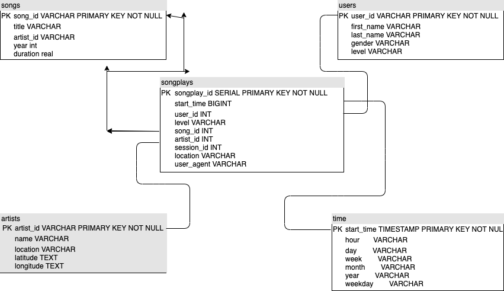

# Data Modeling with Postgress

## Summary
From the requirements the purpose for this project is for a startup called Sparkify to analyze data collected from the users and songs activity of their new streaming service. The analytics team is interested is understanding what songs are being listened to. Currently the data is stored into a json format, which lacks in querying the data. Using the Postgres database for the data to be analyzed, the data tables are used to optimize the query search for the songs being played by the users.

## Database Schema
For this data model I will be using a Postgress Database, and to build the ETL pipeline I will be using Python. For using a relational database the data can be organzied into rows and columns for enhanced analytics. Using an ETL pipeline we can import our data from our files, into enhanced tables in Postgres using Python and mySQL. The ETL process will create five tables with their own category, with these tables each will have their own keys to have enhanced query search. Using mySQL can improve the query, in the table process. 

## How to run
To create the tables:
    - python create_tables.py

To insert the data into the tables:
    - python etl.py
    
## Files Description
- data: Folder containing the song and log data to be imported into the Database
- create_tables.py: Create the database and tables using python and mysql in a python script
- etl.pynb: Jupyter notebook that guides in the process for how to set up the ETL python file
- etl.py: Extract, transforms, and loads the data form the directory
- sql_queries.py: Checks for tables exists, if exists drops to create a new one and an insert records.
- test.ipynb: Is used to test the ETL and for whats in the database

